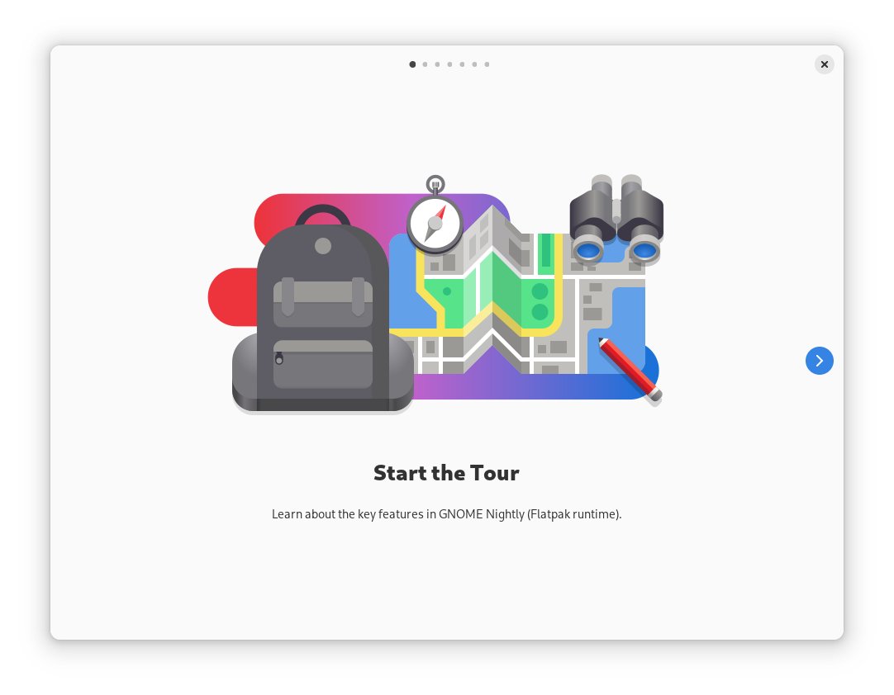

# Tour

GNOME Tour and Greeter

## Screenshots

## Hack on Tour

To build the development version of Tour and hack on the code see the [general
guide](https://welcome.gnome.org/app/Tour/) for building GNOME apps with Flatpak
and GNOME Builder.

## Translations

Helping to translate Tour or add support to a new language is very welcome. You
can find everything you need at:
[l10n.gnome.org/module/gnome-tour/](https://l10n.gnome.org/module/gnome-tour/)

## Code Of Conduct

This project follows the [GNOME Code of Conduct](https://conduct.gnome.org/).
